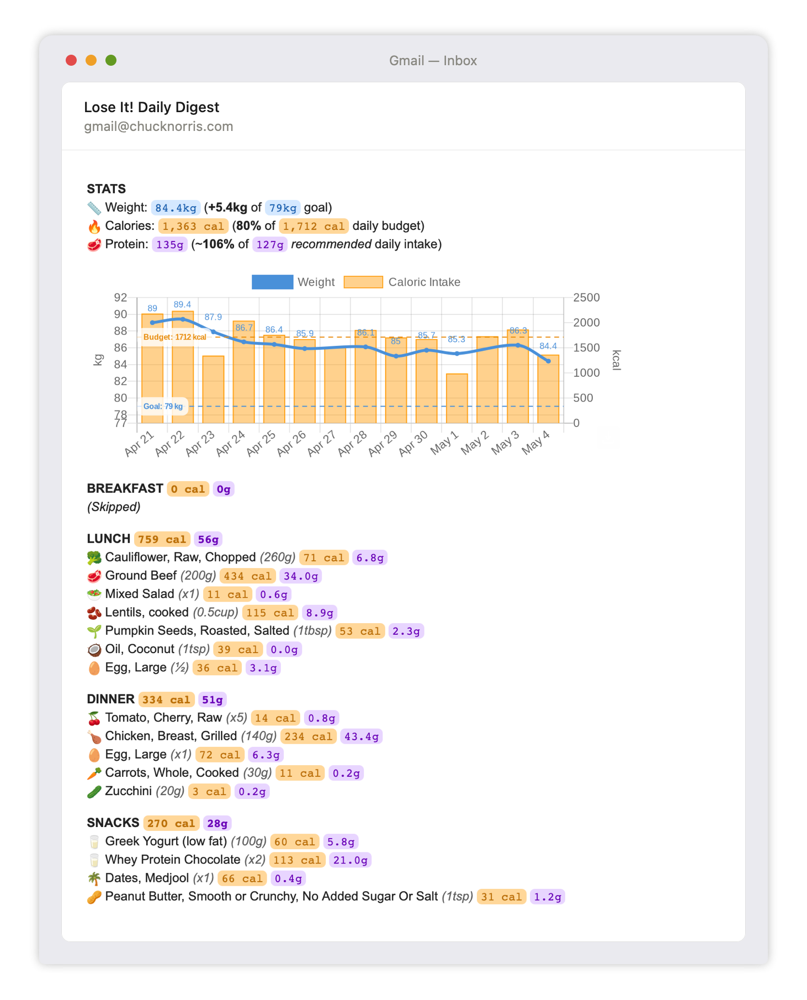

# Lose It! → Google Sheets + Daily Digest

[Lose It!](https://www.loseit.com) is good at tracking food, but is primarily locked into the native mobile app and dashboards/insights is lacking on the web -- to mention nothing of its social/sharing features which are all but nonexistent.

This script aims that close that gap: it reads your personal data from Lose It! and emails a concise daily digest (with useful charts!) to yourself and anyone else that you want to keep in the loop. Adding visibility in this way turns the work one does for personal logging into a lightweight accountability loop.



## Setup

### 1. Export your data from Lose It!

1. Log in to [loseit.com](https://www.loseit.com), and visit `https://loseit.com/export/data` to download the ZIP of all your data.
2. Unzip it.
3. Create a new Google Spreadsheet.
4. For each CSV listed in `src/Config.js`, import it as a new sheet tab named after the file (without `.csv`).

Repeat this process whenever you want to refresh the data -- or you can automate it (more information below).

### 2. Create the Apps Script project

Create your Apps Script within your Google Spreadsheet by the menu option: **Extensions  → Apps Script**.

In the editor, you can copy paste the code from this repo (everything in `/src`) or push the files with [clasp](https://github.com/google/clasp):

```sh

npm install -g @google/clasp
clasp login

cd gas-loseit-export/src
clasp create --title "Lose It! Digest" --parentId "{id}" 

clasp push
```

_(Get the `--parentId` of your Spreadsheet from its URL: `https://docs.google.com/spreadsheets/d/{id}/edit`)_

### 3. Set Script Properties

In the Apps Script editor: **Project Settings → Script Properties → Add property**...

| Property | Value |
|---|---|
| `DIGEST_RECIPIENTS` | Comma-separated email addresses to BCC on the daily digest (including yourself) |
| `LOSEIT_SESSION_COOKIE` | _Optional_ for automated data fetching (see [step #5](#5-automated-sync-optional)) |

### 4. Add a time-based trigger

In the Apps Script editor: **Triggers → Add Trigger → `runDigest` → Time-driven → Day timer**...

Choose the trigger time to match your logging habits.

### 5. Automated sync *(optional)*

The script can also fetch and import your data automatically using your Lose It! browser session cookie, skipping the manual export step. See the [Disclaimer](#disclaimer) as doing so likely violates their Terms of Service.

1. Log in to [loseit.com](https://www.loseit.com) in your browser.
2. Open DevTools → **Application** → **Cookies** → `https://www.loseit.com`.
3. Copy the value of the **`fn_auth`** cookie.
4. Add an additional Script Property: `LOSEIT_SESSION_COOKIE` → the cookie value.
5. Point your trigger (from step #4) at `triggerSyncSend` instead of `runDigest`.

_`triggerSyncSend` fetches the latest data, syncs the sheet, and sends the digest in one run. The script will also email you when the cookie is close to expiry._

## Configuration

Key options in `src/Config.js`:

| Setting | Default | Description |
|---|---|---|
| `WEIGHT_UNIT` | `"lbs"` | Must match **Profile → Settings → Units** in Lose It!. Accepts `"lbs"`, `"kg"`, or `"stones"` (stones are converted and displayed in kg). |
| `PROTEIN_G_PER_KG` | `1.5` | Recommended daily protein target, in grams per kg of body weight. |
| `CHART_WINDOW_DAYS` | `14` | Number of days shown in the calorie chart (sliding window). |

## How it works

**Primary (manual import):**
```
Lose It! website  →  manual export + import  →  Google Sheet tabs
                                                        │
                                                   runDigest()
                                                        │
                                                   daily email
```

**Optional (automated):**
```
Lose It! export endpoint  →  syncData()  →  Google Sheet tabs
        (fn_auth cookie)                           │
                                              runDigest()
                                                   │
                                              daily email
```

| File | Role |
|---|---|
| `Code.js` | Entry points: `runDigest`, `syncData`, `triggerSyncSend` |
| `Config.js` | Reads secrets from Script Properties; defines which CSVs to process |
| `Fetch.js` | Downloads the ZIP, unzips and parses CSVs; checks cookie expiry |
| `Sheets.js` | Reads from and writes to sheet tabs |
| `Digest.js` | Builds and sends the HTML digest email with a 14-day weight/calorie chart |
| `FoodHelpers.js` | Formats food quantities and maps food names to emoji |

The digest is generated from an HtmlService template and includes a chart rendered by [QuickChart](https://quickchart.io).

Edit and run `testDigest()` directly in the Apps Script Editor to resend for a past date. Also useful for testing.

## License

Released under [The Unlicense](UNLICENSE) public domain. No attribution required, no warranty of any kind.

## Disclaimer

Automated fetching of Lose It!'s data (`fetchAndParseCsvs()` used in `syncData()`) likely violates their Terms of Service. It uses a browser session cookie to automate access to the data export endpoint, which is not an authorised form of programmatic access.

This repository is published for personal reference only and is not intended for use by others. You use it entirely at your own risk. The author accepts no responsibility for any consequences, including account suspension or termination.
